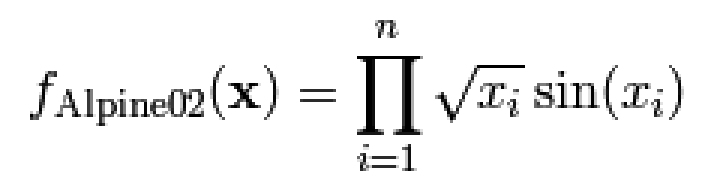
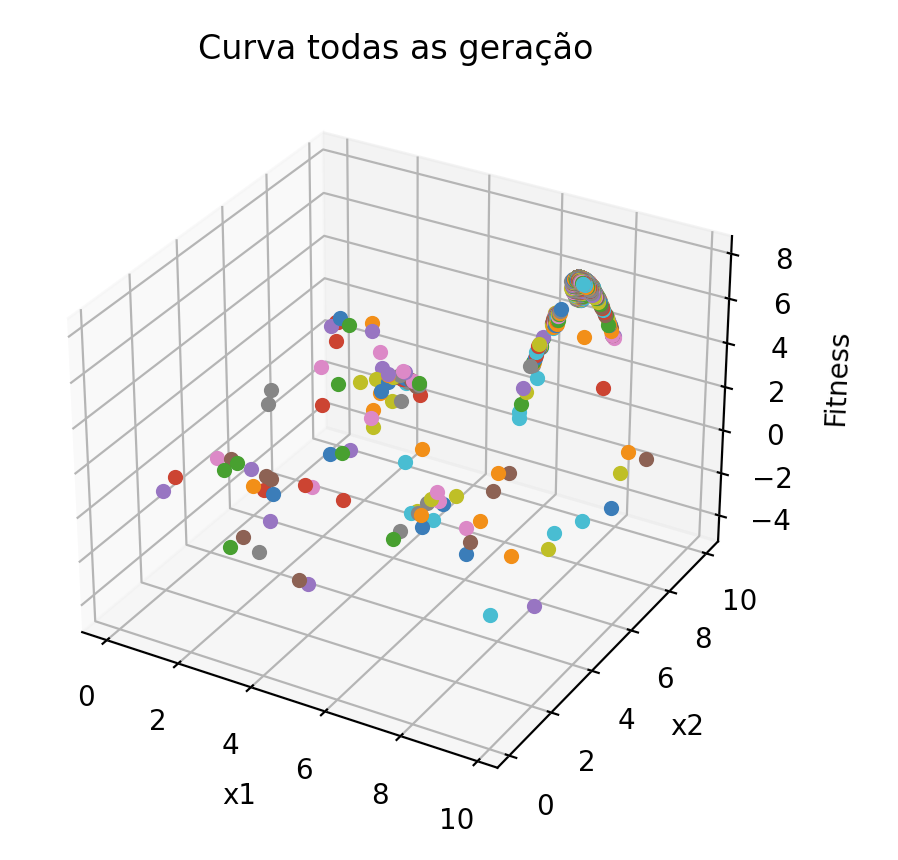

# CLONALG Immunological Algorithmg

CLONALG immunological algorithm to solve a multimodal maximization problem of the following function:

## Graph Result

## References
Castro, L. N.
[Fundamentals of Natural Computing: Basic Concepts, Algorithms, and Applications.](https://books.google.com.br/books?id=2wTOBQAAQBAJ)
CRC Press, 2006, page 300.